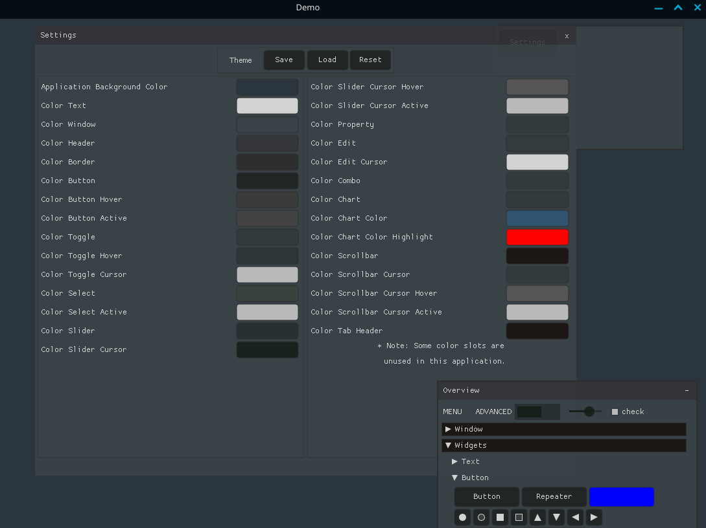
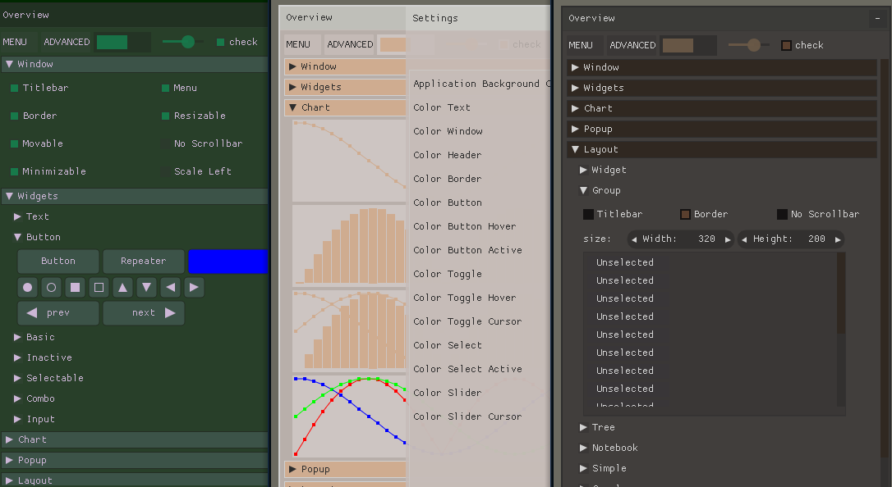

# nk-theme-editor

A theme editor for [Nuklear](https://github.com/Immediate-Mode-UI/Nuklear), an intermediate mode c gui library (single header only)

(This project is a WIP - ripped from an unreleased project)




## prerequisites

- CMake 3.21.0 and above
- C17 and C++17 capable compiler
- Optional: Python and module "[cogapp](http://nedbatchelder.com/code/cog/))" for 'updating target_sources' in /src/CMakeLists.txt

## build

To build the executable run the following commands:

### Windows, Visual Studio

* run_cmake.bat
* open .sln inside build folder
* Build Project

### Linux

```
cmake -S ./ -B ./build
cd ./build
make
cd ..
cmake --install build
```

Or run_cmake.sh


### XCode (untested)

To build XCode project run

`cmake -S ./ -B ./build -GXcode`

## Examples


